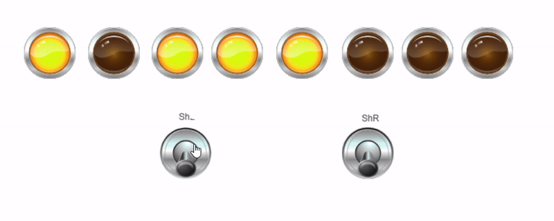
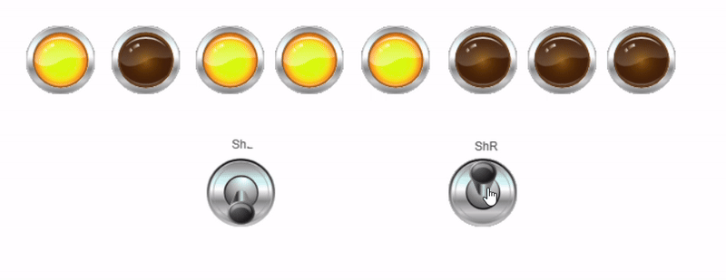

# LED Shift Control Using Switches

This project demonstrates a simple digital control system using two switches and eight LEDs. Some LEDs are initially ON to form a pattern.

Pressing the LEFT switch shifts the active LED pattern one position to the left, while pressing the RIGHT switch shifts the pattern to the right. The system updates the LED states accordingly in real time.

This project is suitable for PLC training, digital logic practice, and basic automation demonstrations.

## Features
- Two directional control switches (Left / Right)
- Eight LEDs with shiftable patterns
- Real-time visual feedback
- Simple and educational control logic

## Applications
- PLC learning projects  
- Digital logic and automation training  
- LED pattern control systems

## 🎬 System Demo

## 💻 PLC Program (Structured Text)
📁 [Open Main Program](plc-code/main_program.st)
